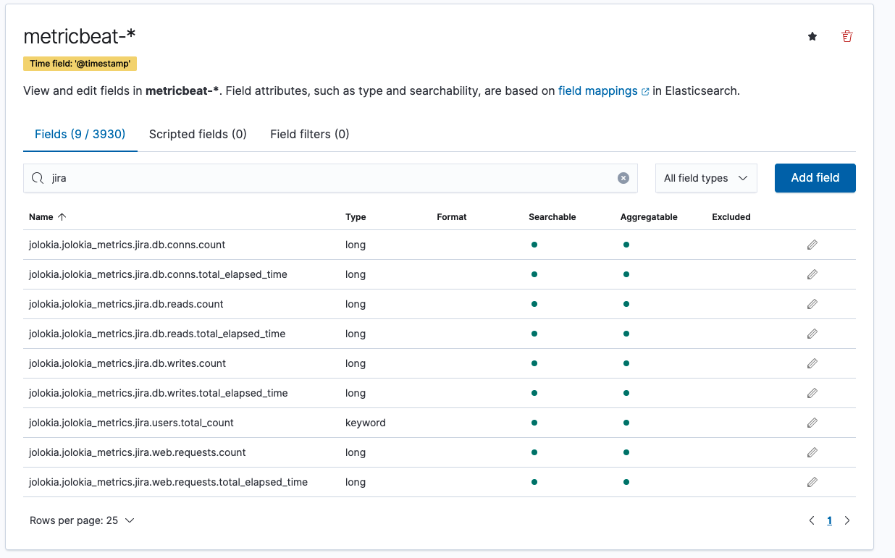

# Configure Metricbeat Jolokia module

## Prerequisite

1. Metricbeat (`version 7.13.2`)agent installed on the host where Jira is installed and running

2. Metricbeat comes to `Jolokia` module, check if it is present 

   ```bash
   $/metricbeat modules list | grep jolokia
   jolokia
   $
   ```

3. In Metricbeat `modules.d` folder replace `jolokia.yml.disabled` file with one available from `Atlastix` 

   ```json
   # jokolia.yml.disabled
   - module: "jolokia"
     metricsets: ["jmx"]
     enabled: true
     period: 10s
     namespace: "jolokia_metrics"
     hosts: ["<jira_host>:<port>"]
     #username: "tomcat"
     #password: "tomcat"
     path: "/plugins/servlet/jolokia/?ignoreErrors=true&canonicalNaming=false"
     ssl.verification_mode: "none"
     jmx.mappings:
       - mbean: 'java.lang:type=Runtime'
         attributes:
           - attr: Uptime
             field: uptime
       - mbean: 'java.lang:type=Memory'
         attributes:
           - attr: HeapMemoryUsage
             field: memory.heap_usage
           - attr: NonHeapMemoryUsage
             field: memory.non_heap_usage
       - mbean: 'java.lang:type=Threading'
         attributes:
           - attr: ThreadCount
             field: threadcount.threadcount
           - attr: DaemonThreadCount
             field: threadcount.daemon
       - mbean: 'com.atlassian.jira:type=db.conns'
         attributes:
           - attr: invocation.count
             field: jira.db.conns.count
           - attr: total.elapsed.time
             field: jira.db.conns.total_elapsed_time
       - mbean: 'com.atlassian.jira:type=web.requests'
         attributes:
           - attr: invocation.count
             field: jira.web.requests.count
           - attr: total.elapsed.time
             field: jira.web.requests.total_elapsed_time
       - mbean: 'com.atlassian.jira:type=entity.users.total'
         attributes:
           - attr: entity.users.total
             field: jira.users.total_count
       - mbean: 'com.atlassian.jira:type=db.reads'
         attributes:
           - attr: invocation.count
             field: jira.db.reads.count
           - attr: total.elapsed.time
             field: jira.db.reads.total_elapsed_time
       - mbean: 'com.atlassian.jira:type=db.writes'
         attributes:
           - attr: invocation.count
             field: jira.db.writes.count
           - attr: total.elapsed.time
             field: jira.db.writes.total_elapsed_time
   
   ```

   > To add more mbean and attributes provided by Jira, you can use JConsole. Some properties of MBean are specific to Java Virtual Machine (JVM) running on the host. Hence based on the JVM runtime  some properities may differ. For example GarbageCollector and JVM properties. If you want to monitor these then you will need use JConsole to Query and analyse what is available.

4. Enable the `Jolokia` metricbeat module 

   ```bash
   $ metricbeat modules enable jolokia
   ```

   

5. Restart `metricbeat` agent

6. Once you restart metricbeat and you should be able to see the Mbean fields and values in metricbeat index

   

   