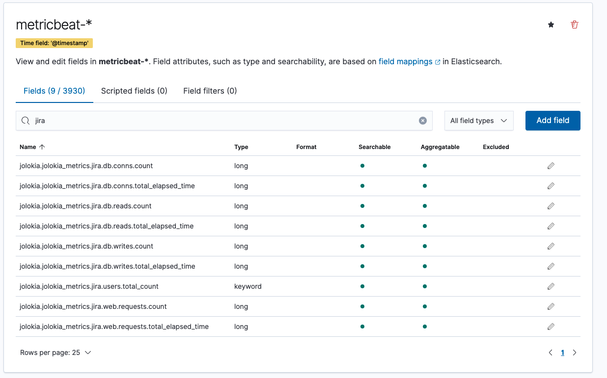

# Configure Metricsbeat Jolokia module

## Prerequisite

1. Metricsbeat (`version 7.13.2`)agent installed on the host where Jira is installed and running

2. Metricbeat comes to `Jolokia` module, check if it is present 

   ```bash
   $/metricbeat modules list | grep jolokia
   jolokia
   $
   ```

3. In Metricbeat `modules.d` folder replace `jolokia.yml.disabled` file with one available from `Atlastix` 

   ```json
   # jokolia.yml.disabled
   - module: "jolokia"
     metricsets: ["jmx"]
     enabled: true
     period: 10s
     namespace: "jolokia_metrics"
     hosts: ["<jira_host>:<port>"]
     #username: "tomcat"
     #password: "tomcat"
     path: "/plugins/servlet/jolokia/?ignoreErrors=true&canonicalNaming=false"
     ssl.verification_mode: "none"
     jmx.mappings:
       - mbean: 'java.lang:type=Runtime'
         attributes:
           - attr: Uptime
             field: uptime
       - mbean: 'java.lang:type=Memory'
         attributes:
           - attr: HeapMemoryUsage
             field: memory.heap_usage
           - attr: NonHeapMemoryUsage
             field: memory.non_heap_usage
       - mbean: 'java.lang:type=Threading'
         attributes:
           - attr: ThreadCount
             field: threadcount.threadcount
           - attr: DaemonThreadCount
             field: threadcount.daemon
       - mbean: 'com.atlassian.jira:type=db.conns'
         attributes:
           - attr: invocation.count
             field: jira.db.conns.count
           - attr: total.elapsed.time
             field: jira.db.conns.total_elapsed_time
       - mbean: 'com.atlassian.jira:type=web.requests'
         attributes:
           - attr: invocation.count
             field: jira.web.requests.count
           - attr: total.elapsed.time
             field: jira.web.requests.total_elapsed_time
       - mbean: 'com.atlassian.jira:type=entity.users.total'
         attributes:
           - attr: entity.users.total
             field: jira.users.total_count
       - mbean: 'com.atlassian.jira:type=db.reads'
         attributes:
           - attr: invocation.count
             field: jira.db.reads.count
           - attr: total.elapsed.time
             field: jira.db.reads.total_elapsed_time
       - mbean: 'com.atlassian.jira:type=db.writes'
         attributes:
           - attr: invocation.count
             field: jira.db.writes.count
           - attr: total.elapsed.time
             field: jira.db.writes.total_elapsed_time
   
   ```

   > To add more mbean and attributes provided by Jira, you can use JConsole, some propertities of MBean are specific to Java Virtual Machine running on the host. Hence based on the Runtime some properities may differ for example GarbageCollector and JVM properties. If you want to monitor those then you will need use JConsole for Query what is available.

4. Enable the `Jolokia` metricbeat module 

   ```bash
   $ metricbeat modules enable jolokia
   ```

   

5. Restart `metricsbeat` agent

6. Once you restart metricsbeat and you should be able to see the Mbean fields and values in metricsbeat index

   

   